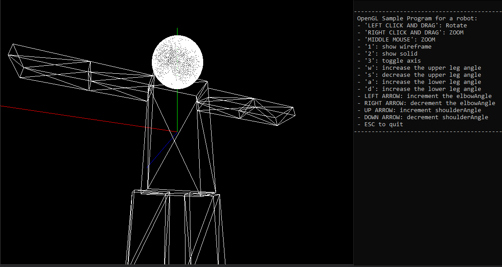
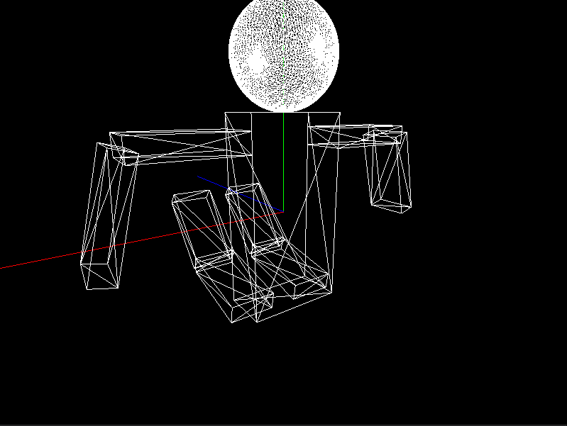

## Computer Graphics Assignmenet 3 ##
This is assignment 3 for CS 4701 Computer Graphics at Kent State University.
The assignment was to create a robot with movable arms and legs.
It is windows only 64 bit only, and is based off this [tutorial here](https://heavenkong.blogspot.com/2018/03/opengl-installation-of-opengl-with.html)

The derivations from the linked tutorial are as follows:
* Removed x86 solution
* Solution automatically copies dlls to build directory, so you don't need to inject them into system32

To build, just start visual studio 2019 and build for either debug or release mode.

### Pictures

